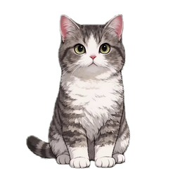
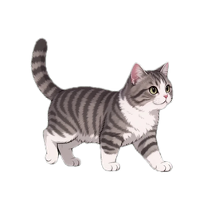
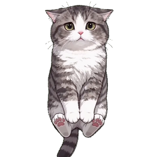
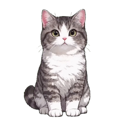
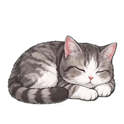
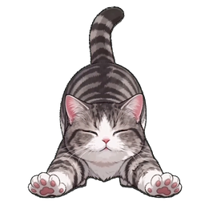

# MomoDesk

MomoDesk 是一个正在开发中的桌面猫咪宠物应用。目标是让 Momo 像一只小猫一样停在桌面上，会待机、走动、睡觉、被鼠标拖起来、放下后摇头，以及在合适的时候伸懒腰。

项目目前使用 Tauri 2 + Vite + TypeScript 构建，前端用 Canvas 渲染透明背景猫咪动画，桌面端负责窗口置顶、透明窗口、拖动和托盘菜单。

## 动作预览

| 待机 | 行走 | 鼠标提起 |
| --- | --- | --- |
|  |  |  |

| 放下 | 睡觉 | 伸懒腰 |
| --- | --- | --- |
|  |  |  |

## 当前功能

- 透明桌面宠物窗口，默认悬浮在桌面上。
- Canvas 渲染猫咪序列帧动画。
- 支持待机、左右行走、拖拽提起、放下、睡觉、伸懒腰等动作。
- 鼠标拖动时播放提起和挣扎动画，松开后播放落下动画。
- 托盘菜单已中文化，可召回、喂食、睡觉、显示、隐藏和退出。
- 动作资源通过 `assets/pets/default/pet.json` 统一配置，后续可以继续扩展动作包。

## 快速运行

开发环境说明见 [docs/runtime-environment.md](docs/runtime-environment.md)。

Windows 下可以直接双击：

```text
run-momodesk.bat
run-browser-preview.bat
```

也可以手动执行：

```powershell
npm install
npm run dev
npm run build
```

安装 Rust 和 Cargo 后，可以运行桌面端：

```powershell
npm run tauri dev
```

## 素材目录

猫咪动作资源集中放在：

```text
assets/pets/default/actions/
```

每个动作通常包含：

- `frames/`：运行时使用的透明 PNG 序列帧。
- `source/`：原始视频位置，仅保留 `.gitkeep`，视频源文件不提交。
- `metadata.json`：抽帧、帧率、循环等动作信息。

资源包入口是：

```text
assets/pets/default/pet.json
```

更完整的素材规范见 [docs/action-assets.md](docs/action-assets.md) 和 [docs/pet-package.md](docs/pet-package.md)。

## 后续计划

- 补齐更多猫咪动作，例如吃东西、梳理毛发、睡姿切换、互动反馈。
- 优化动作之间的状态机，让不同姿态之间的衔接更自然。
- 继续整理 AI 生成、抽帧、抠图和序列帧打包流程。
- 增加更多桌面交互，例如靠近鼠标、呼唤、随机小动作和心情状态。
